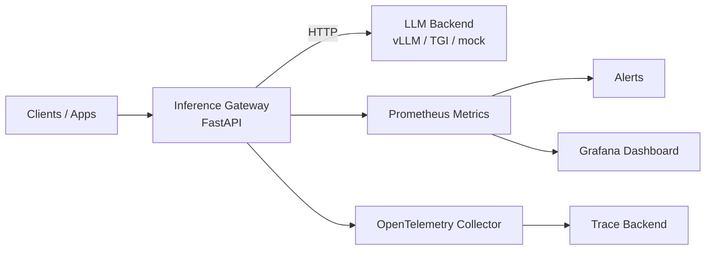

# LLM Inference Platform on Kubernetes

This is a hands-on learning project for exploring the infrastructure patterns behind production LLM serving. It implements an OpenAI-compatible inference gateway, Kubernetes deployment assets, and an observability stack to practice the kind of systems work used in ML infrastructure teams.

The goal is to connect application engineering, model-serving operations, and platform reliability in one small but realistic codebase. The service runs locally with a mock backend, while the deployment shape is designed so a real vLLM or TGI-style model server can be plugged in later.

## Learning Goals

- Build an API gateway that exposes a stable LLM inference interface
- Practice Kubernetes deployment patterns for resilient services
- Understand how inference traffic is measured with metrics, traces, and dashboards
- Separate gateway concerns from model backend concerns
- Explore operational workflows such as smoke tests, load tests, alerts, and runbooks

## What It Includes

- OpenAI-compatible `/v1/chat/completions` inference gateway
- Backend adapter pattern for mock, vLLM, or TGI-style HTTP model servers
- Prometheus metrics for latency, request volume, token volume, and backend errors
- OpenTelemetry trace export with request correlation IDs
- Kubernetes deployment with probes, resource requests, HPA, PDB, NetworkPolicy, and Kustomize overlays
- Grafana dashboard and Prometheus alert rules for operational visibility
- Locust load test and smoke-test scripts
- Architecture notes and a runbook for common production scenarios

## Architecture



## Quick Start

```bash
python3 -m venv .venv
source .venv/bin/activate
pip install -e ".[dev]"
uvicorn app.main:app --app-dir services/gateway --host 127.0.0.1 --port 8080
```

Send a request:

```bash
curl -s http://127.0.0.1:8080/v1/chat/completions \
  -H 'content-type: application/json' \
  -d '{"model":"learning-llm","messages":[{"role":"user","content":"Explain GPU batching in one sentence."}]}'
```

Run the smoke test:

```bash
BASE_URL=http://127.0.0.1:8080 scripts/smoke-test.sh
```

Inspect Prometheus metrics:

```bash
curl -s http://127.0.0.1:8080/metrics | head
```

## Kubernetes

Render manifests locally:

```bash
kubectl kustomize k8s/overlays/local
```

Deploy to a cluster:

```bash
kubectl apply -k k8s/overlays/local
```

## Repository Map

- `services/gateway`: Python FastAPI inference gateway
- `k8s`: Kubernetes base and local overlay
- `observability`: Prometheus rules and Grafana dashboard
- `loadtest`: Locust workload
- `scripts`: smoke test helpers
- `docs`: architecture notes, runbook, and role-transition talking points

## Role-Transition Notes

The implementation is intentionally scoped around skills that are useful when moving toward ML infrastructure work: API design, Kubernetes operations, reliability engineering, metrics, tracing, and model-serving architecture. See [docs/resume.md](docs/resume.md) for a concise summary of the technical areas covered.
