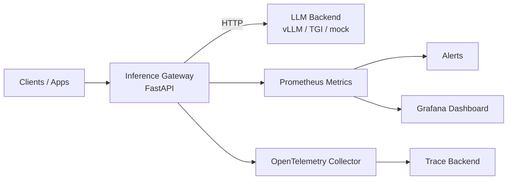

# LLM Inference Platform on Kubernetes

Production-grade reference platform for serving LLM traffic with Kubernetes, autoscaling, and observability. The project is designed as a resume portfolio piece for ML infrastructure roles: it shows API design, reliability controls, deployment topology, metrics, tracing, dashboards, and operational runbooks.

## What It Demonstrates

- OpenAI-compatible `/v1/chat/completions` inference gateway
- Backend adapter pattern for mock, vLLM, or TGI-style HTTP model servers
- Prometheus metrics for latency, request volume, token volume, and backend errors
- OpenTelemetry trace export with request correlation IDs
- Kubernetes deployment with probes, resource requests, HPA, PDB, NetworkPolicy, and Kustomize overlays
- Grafana dashboard and Prometheus alert rules for production-style operations
- Locust load test and smoke-test scripts
- Architecture docs, runbook, and resume bullet points

## Architecture



## Quick Start

```bash
python3 -m venv .venv
source .venv/bin/activate
pip install -e ".[dev]"
uvicorn app.main:app --app-dir services/gateway --reload
```

Send a request:

```bash
curl -s http://127.0.0.1:8000/v1/chat/completions \
  -H 'content-type: application/json' \
  -d '{"model":"resume-llm","messages":[{"role":"user","content":"Explain GPU batching in one sentence."}]}'
```

## Kubernetes

Render manifests locally:

```bash
kubectl kustomize k8s/overlays/local
```

Deploy to a cluster:

```bash
kubectl apply -k k8s/overlays/local
```

## Repository Map

- `services/gateway`: Python FastAPI inference gateway
- `k8s`: Kubernetes base and local overlay
- `observability`: Prometheus rules and Grafana dashboard
- `loadtest`: Locust workload
- `scripts`: smoke test helpers
- `docs`: architecture, runbook, and resume positioning

## Resume Positioning

See [docs/resume.md](docs/resume.md) for concise ML infra bullet points and interview talking points.
